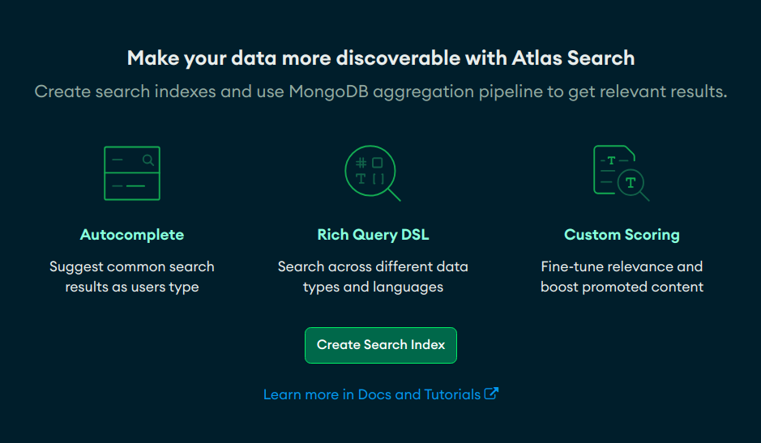

# Atlas Search



- Relevance-based search on MongoDB is where the user searched for "Pakistan" and the results returned were relevant to that search term.

- A search index is used to describe how the application search algorithm should work. You can customize this with Atlas Search.
- A search with a dynamic index will query against all of the fields, including nested fields, with equal weight placed on all fields.
- The “filter” clause eliminates results that match the clause.
- "Must", "must not", and "should" are all clauses, but "filter" does not impact the score given to the results.
- **Facets:** Buckets that we group our search results into.
- To group your search results, use the facet operator.
- To view the search metadata (facets and their count), use the `$searchMeta` stage.

## Using `$search` and Compound Operators

The compound operator within the `$search` aggregation stage allows us to give weight to different field and also filter our results without having to create additional aggregation stages. The four options for the compound operator are "must", "mustNot, "should", and "filter".

"must" will exclude records that do not meet the criteria. "mustNot" will exclude results that do meet the criteria. "should" will allow you to give weight to results that do meet the criteria so that they appear first. "filter" will remove results that do not meet the criteria.

```js
[
  {
    $search: {
      compound: {
        must: [
          {
            text: {
              query: "field",
              path: "habitat",
            },
          },
        ],
        should: [
          {
            range: {
              gte: 45,
              path: "wingspan_cm",
              score: { constant: { value: 5 } },
            },
          },
        ],
      },
    },
  },
];
```

## Grouping Search Results by Using Facets

`$searchMeta` and `$facet`

`$searchMeta` is an aggregation stage for Atlas Search where the metadata related to the search is shown. This means that if our search results are broken into buckets, using `$facet`, we can see that in the `$searchMeta` stage, because those buckets are information about how the search results are formatted.

```js
[
  {
    $searchMeta: {
      facet: {
        operator: {
          text: {
            query: ["Northern Cardinal"],
            path: "common_name",
          },
        },
      },
      facets: {
        sightingWeekFacet: {
          type: "date",
          path: "sighting",
          boundaries: [
            ISODate("2022-01-01"),
            ISODate("2022-01-08"),
            ISODate("2022-01-15"),
            ISODate("2022-01-22"),
          ],
          default: "other",
        },
      },
    },
  },
];
```

"facet" is an operator within $searchMeta. "operator" refers to the search operator - the query itself. "facets" operator is where we put the definition of the buckets for the facets.

https://learn.mongodb.com/learn/course/mongodb-atlas-search/lesson-2-creating-a-search-index-with-dynamic-mapping/learn?client=customer

// apply this vector search in youtube..remove
