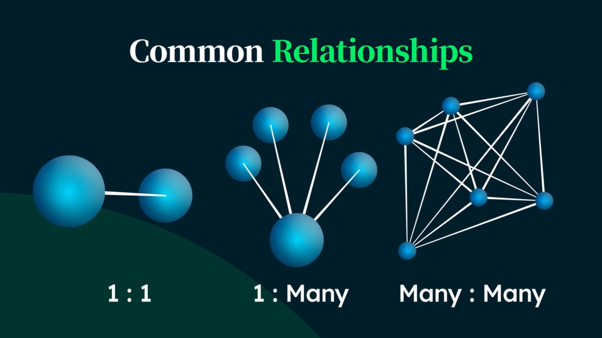
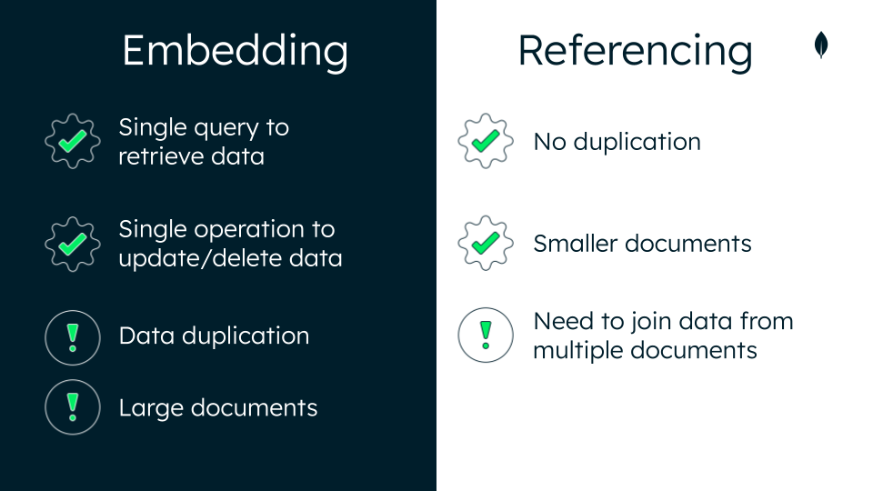
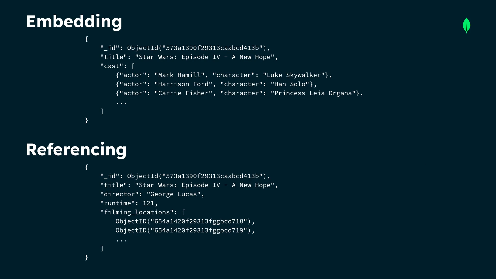

# Data Modeling

Data that is accessed together should be stored together. How you model your data depends entirely on your particular application's data access patterns. You want to structure your data to match the ways that your application queries and updates it.

## Points

- Defining how data is stored is one function of data modeling. Data modeling helps you use your data effectively to meet information needs.
- The document model does not enforce any document structure by default. This means that documents, even in the same collection can have different structures.
- Structure your data to match the ways that your application queries and update it (data).

- Defining the relationships that exist among different entities in your data is one function of data modeling. Data modeling enables you to document data requirements for applications and identify errors in development plans before any code is written.
- A proper data model makes it easier to manage your data. It will sustain growing data volumes and adjust easily to the addition or deletion of data.
- A proper data model makes queries more efficient. It helps developers understand the database and tune it for fast performance, which makes reading and writing to the database faster.
- A proper data model uses less memory and CPU. Data modeling helps you better estimate and model memory requirements.
- A proper data model can reduce costs by using your database more efficiently. Data modeling catches errors and oversights early, when they are easier to fix.

## Relations

1. **One to one:** A relationship where a data entity in one set is connected to exactly one data entity in another set.

2. **One to Many:** A relationship where a data entity in one set is connected to any number of data entities in another set.
3. **Many to Many:** A relationship where any number of data entity in one set are connected to any number of data entities in another set.

## Embedding vs. Referencing

These are 2 primary way to model relationships in MongoDB

Here's a quick summary of the pro's and con's of embedding vs. referencing in MongoDB:

1. **Embedding:** We take related data and insert it into our document.

   - Also called `Nested Documents` (i.e this is not vector embedding).
   - Avoids application joins
   - Provides better performance for read operations.
   - Embedding data simplifies queries because it avoids application joins. It fulfills the principle that data that is accessed together should be stored together.
   - Embedding data provides better performance for read operations. Embedded documents enable you to store all kinds of related information in a single document.
   - Embedding is often used when there are one-to-many relationships in the data that's being stored. MongoDB recommends embedding documents to simplify queries and improve overall query performance.
   - Con: Doc can be large and can slow performance.

2. **Referencing:** We refer to documents in another collection in our document.

   - Save the \_id field of one doc in another doc as a link between the two.
   - Simple and sufficient for most use cases.
   - Using references is called linking or data normalization.

Unbounded documents

Embedding data will make the document larger and impact write performance. As more data is added to each document, the entire document is rewritten into MongoDB data storage.

Unbounded documents caused by embedding will eventually run into storage problems by exceeding the maximum document size of 16 MB.

To prevent unbounded document sizes that may result from embedding, you can break up your data into multiple collecitons and use references to keep frequently accessed data together.

 Avoid:
More than the document size limit of 16MB
Poor query performance
Poor write performance
Too much memory being
used

Common schema
anti-patterns:
Massive arrays
Massive number of
collections
Bloated documents
Unnecessary indexes
Queries without indexes
Data that's accessed together, but stored in different collections

The Schema Anti-Patterns tab highlights any issues in the collection and provides details to resolve them. You can improve your schema by resolving the anti-patterns that are shown.

