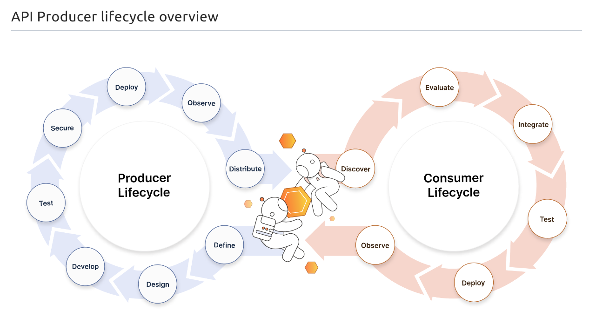

# Learning APIs and Postman

## [Postman Learning Docs](https://learning.postman.com/docs/getting-started/introduction/)

## [Postman Academy](https://academy.postman.com/)

 

[API Development Lifecycle](https://apis.how//products/web-design/)

### REST APIs

Some traits of REST APIs include not storing session state between requests, the ability to cache, and ability to send and receive various data types.
